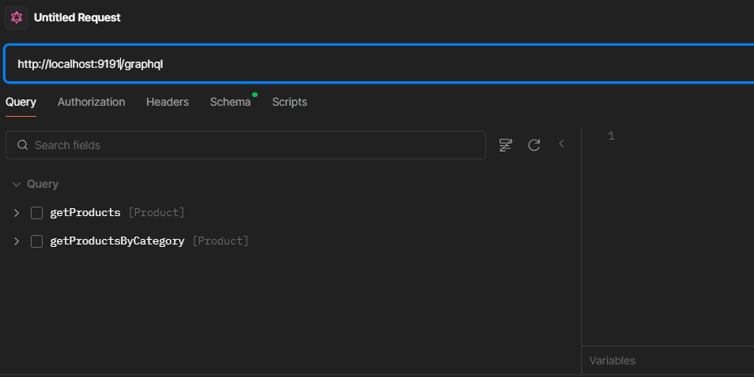
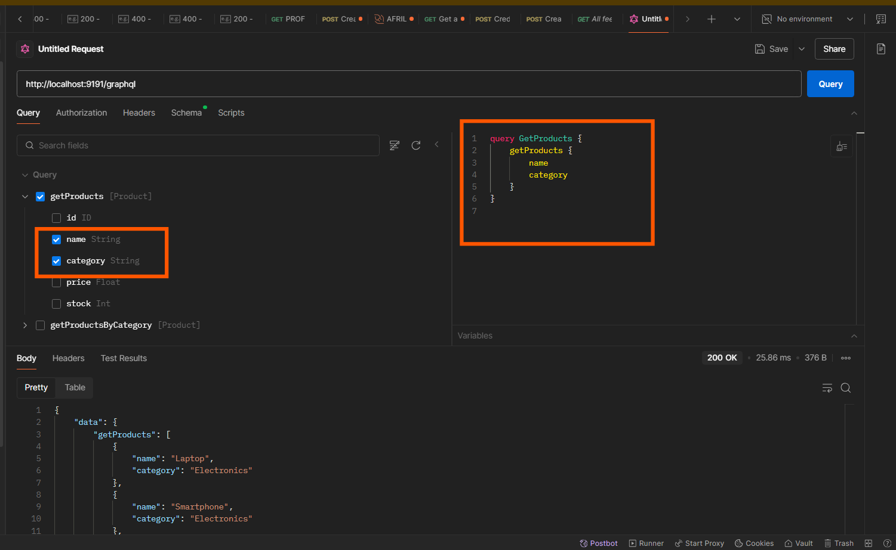
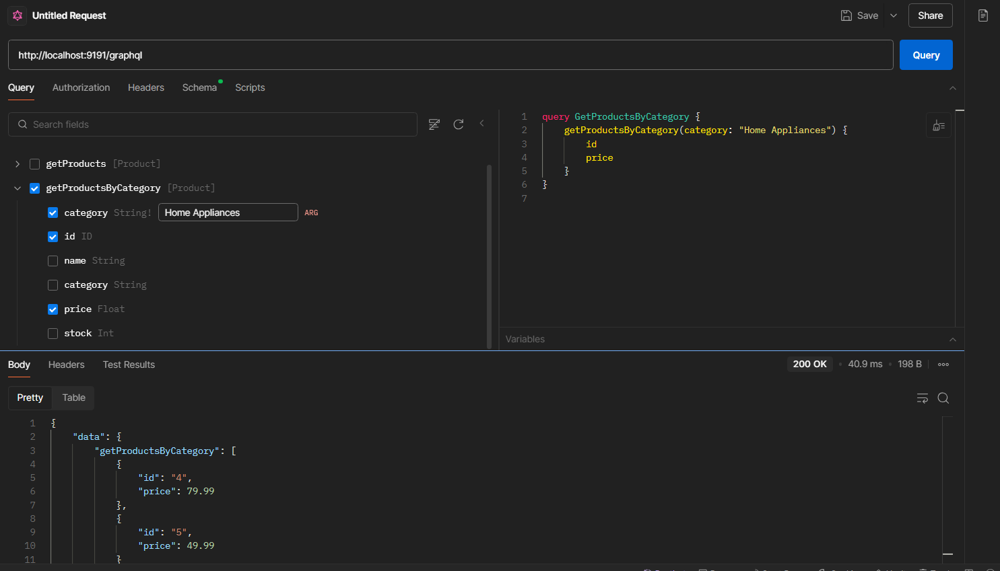
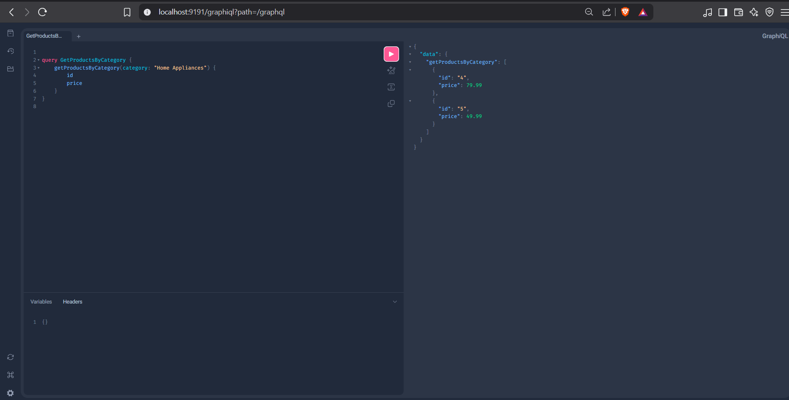
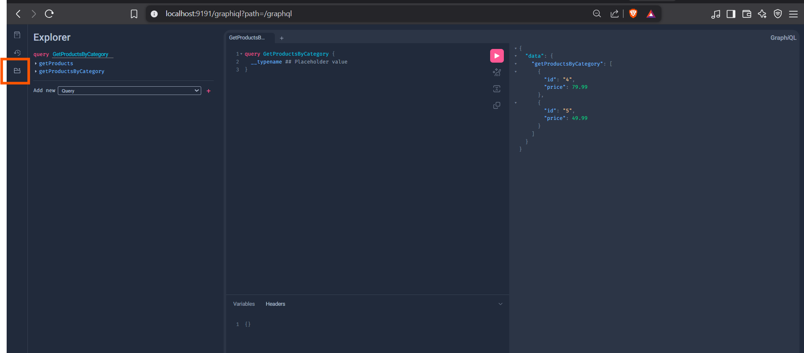
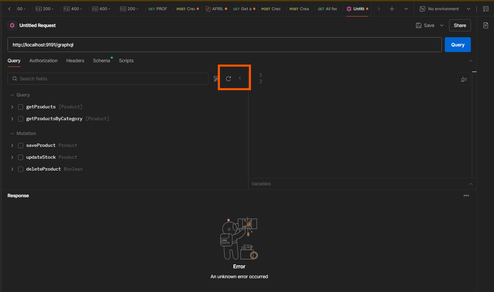
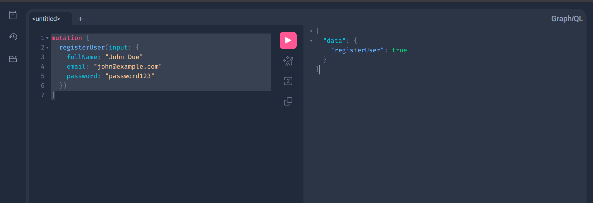
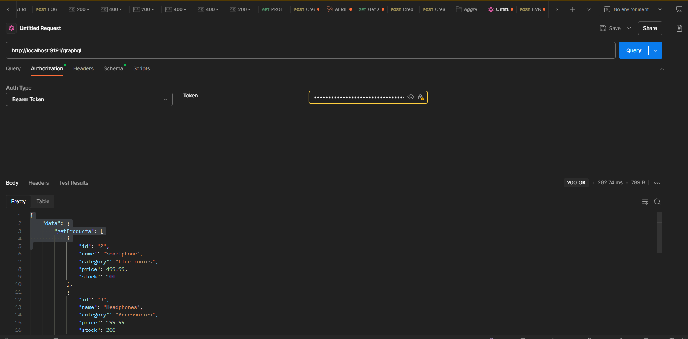

once you post your graphql endpoint in postman, you will see the following:






### Use graphql playground
http://localhost:9191/graphiql




### Reload with the button shown in the image below




```graphql
mutation RegisterUser {
  registerUser(
    input: {
      fullName: "lim"
      email: "lim@yopmail.com"
      role: USER
      password: "limosin"
    }
  )
}
```

```graphql
mutation Login {
    login(input: { username: "lim@yopmail.com", password: "limosin" }) {
        accessToken
        refreshToken
    }
}

```




```graphql
query GetProductsPaginated2 {
    getProductsPaginated(pagination: { page: 0, size: 10 }) {
        page
        size
        totalElements
        totalPages
        content {
            id
            name
            category
            stock
        }
    }
}
```